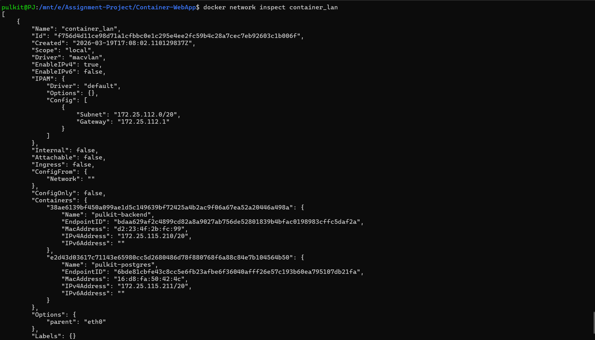
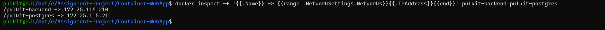
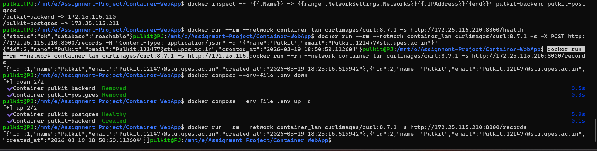

# Containerized Web Application with PostgreSQL

[](https://github.com/Pullkitt/Container-WebApp)

This repository contains a containerized web application built for Assignment 1 with the following stack:

- FastAPI backend
- PostgreSQL database (custom image)
- Separate Dockerfiles for backend and database
- Docker Compose orchestration
- External macvlan network with static IPs
- Named volume for persistent PostgreSQL data

## GitHub Repository

https://github.com/Pullkitt/Container-WebApp

## Project Structure

```text
.
|-- backend/
|   |-- app/
|   |   `-- main.py
|   |-- .dockerignore
|   |-- Dockerfile
|   `-- requirements.txt
|-- database/
|   |-- init/
|   |   `-- 01-init.sql
|   |-- .dockerignore
|   `-- Dockerfile
|-- docs/
|   |-- report-project.md
|   `-- macvlan-vs-ipvlan.md
|-- sceenshots/
|   |-- container-ips.png
|   |-- docker-inspect.png
|   `-- volume-persistent.png
|-- .env.example
|-- .gitignore
|-- docker-compose.yml
`-- README.md
```

## API Endpoints

- `POST /records` inserts a record
- `GET /records` fetches all records
- `GET /health` healthcheck

## 1. Configure Environment Variables

Create `.env` from `.env.example` and set secure values.

```bash
cp .env.example .env
```

## 2. Create External Macvlan Network Manually (Mandatory)

Check the active interface and route details first:

```bash
ip route show
```

For the current WSL2 setup used in this project, create the network manually with:

```bash
docker network create -d macvlan \
	--subnet=172.25.112.0/20 \
	--gateway=172.25.112.1 \
	-o parent=eth0 \
	container_lan
```

This creates an external network named `container_lan` that Compose uses.

## 3. Build and Start Stack

```bash
docker compose --env-file .env up --build -d
```

## 4. Validate Functional Requirements

Healthcheck:

In WSL2, use your configured backend static IP from `.env` (default below):

```bash
curl http://172.25.115.210:8000/health
```

Insert record:

```bash
curl -X POST http://172.25.115.210:8000/records -H "Content-Type: application/json" -d '{"name":"Pulkit","email":"Pulkit.121477@stu.upes.ac.in"}'
```

Fetch records:

```bash
curl http://172.25.115.210:8000/records
```

## 5. Screenshot Proof Commands

Network inspect:

```bash
docker network inspect container_lan
```

Container IPs:

```bash
docker inspect -f '{{.Name}} -> {{range .NetworkSettings.Networks}}{{.IPAddress}}{{end}}' pulkit-backend pulkit-postgres
```

Volume persistence test:

1. Insert records using `POST /records`.
2. Restart containers:

```bash
docker compose --env-file .env down
docker compose --env-file .env up -d
```

3. Call `GET /records` and verify previous records still exist.

Recommended API validation from the same macvlan network:

```bash
docker run --rm --network container_lan curlimages/curl:8.7.1 -s http://172.25.115.210:8000/health
docker run --rm --network container_lan curlimages/curl:8.7.1 -s -X POST http://172.25.115.210:8000/records -H "Content-Type: application/json" -d '{"name":"Pulkit","email":"Pulkit.121477@stu.upes.ac.in"}'
docker run --rm --network container_lan curlimages/curl:8.7.1 -s http://172.25.115.210:8000/records
```

## 6. Uploaded Screenshot Proofs

The repository already includes proof screenshots in `sceenshots/`:

- Docker network inspect proof: `sceenshots/docker-inspect.png`
- Static container IP proof: `sceenshots/container-ips.png`
- Volume persistence proof: `sceenshots/volume-persistent.png`

Preview:





## 7. Image Sizes

Inspect built image sizes using:

```bash
docker images | grep -E 'container-webapp|postgres'
```

The backend image (181 MB) demonstrates multi-stage build optimization, while the database image (276 MB) shows production-grade Alpine-based customization with initialization scripting.

## 8. Implementation Details

The following architectural and deployment patterns are implemented:

- Backend and database use separate Dockerfiles with multi-stage builds.
- Non-root runtime users in both backend (`appuser`) and database (`postgres`).
- Docker Compose orchestrates both services with:
  - External macvlan network for IP-level isolation
  - Static IP assignment for predictable addressing
  - Named volume for persistent PostgreSQL data
  - Restart policy for fault recovery
  - Health checks for service readiness monitoring
  - Dependency ordering with health condition checks

## 9. Macvlan Host Isolation

In macvlan mode, the host usually cannot directly reach containers on the same macvlan network due to Linux kernel isolation behavior. A common workaround is adding a separate macvlan sub-interface on the host.

In WSL2 specifically, IP ranges like `172.25.x.x` are usually virtual and may not be reachable from other physical LAN devices. For production deployment targeting true LAN connectivity, use a native Linux host with a physical network interface. This project demonstrates networking concepts and is suitable for development and testing in containerized virtualized environments.