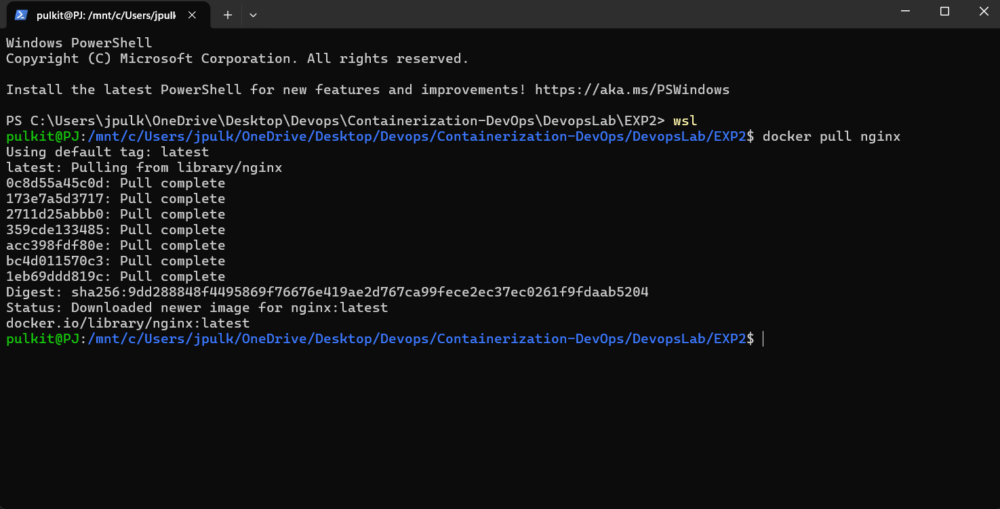
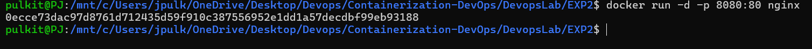
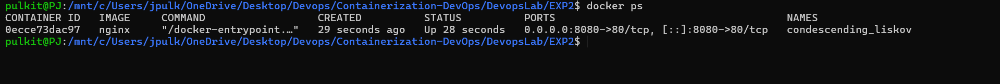
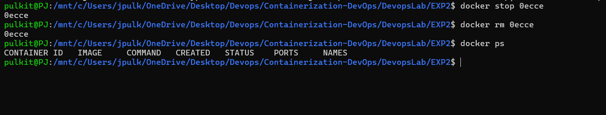
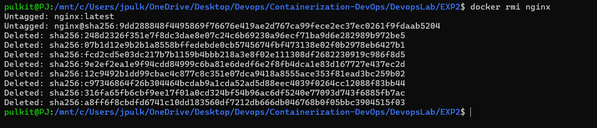

**Name:** Pulkit Jain  
**SAP ID:** 500121477  
**Batch:** B3 (CCVT)

# Lab – Experiment 2

## Objective
- Pull Docker images
- Run containers
- Manage container lifecycle

---
## Procedure

### Step 1: Pull Image
```bash
docker pull nginx
```


### Step 2: Run Container with Port Mapping
```bash
docker run -d -p 8080:80 nginx
```


### Step 3: Verify Running Containers
```bash
docker ps
```


### Step 4: Stop and Remove Container
```bash
docker stop <container_id>
docker rm <container_id>
```


### Step 5: Remove Image
```bash
docker rmi nginx
```


---
## Result
Docker images were successfully pulled, containers executed, and lifecycle commands performed.

---
## Read More (Experiment 2)
- [Docker Images](https://docs.docker.com/get-started/docker-concepts/building-images/)
- [Docker CLI Reference](https://docs.docker.com/engine/reference/commandline/docker/)
- [Docker Hub](https://hub.docker.com/)

---
## Overall Conclusion
This lab demonstrated virtualization using Vagrant + VirtualBox and containerization using Docker, highlighting clear performance and resource efficiency differences. Containers are better suited for rapid deployment and microservices, while VMs provide stronger isolation.

---
